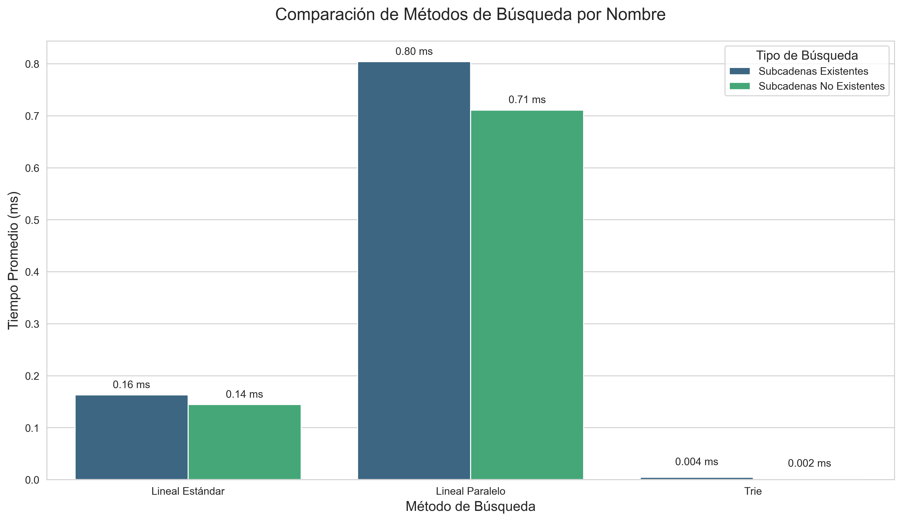
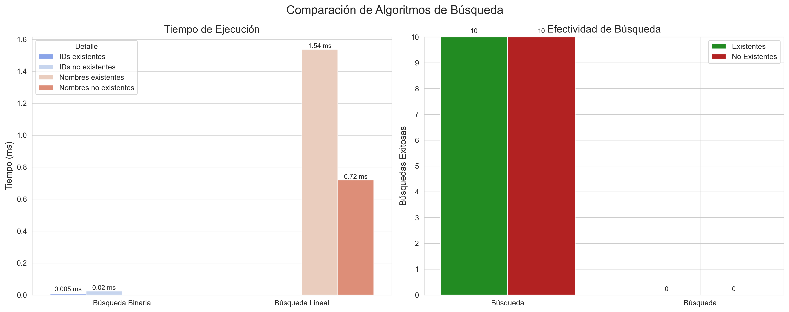
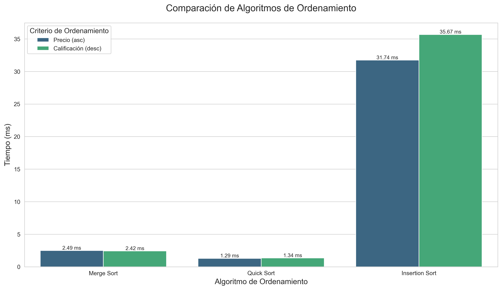

<!-- CABECERA DEL PROYECTO -->
<h1 align="center">🛒✨ Sistema de Gestión y Benchmark de Productos de Tienda Online ✨🛒</h1>
<p align="center">
  <b>Plataforma Python para generación, ordenamiento, búsqueda y visualización de productos con algoritmos avanzados.</b>
  <br>
  
  
</p>

<hr>

<!-- ÍNDICE -->
<details>
  <summary><b>📚 Tabla de Contenidos</b></summary>
  <ol>
    <li><a href="#acerca">📦 Acerca del Proyecto</a></li>
    <li><a href="#caracteristicas">✨ Características</a></li>
    <li><a href="#capturas">🖼️ Capturas de Pantalla</a></li>
    <li><a href="#uso">🚀 Uso</a></li>
    <li><a href="#codigo">🧩 Código Completo</a></li>
    <li><a href="#visualizaciones">📊 Visualizaciones</a></li>
    <li><a href="#licencia">📝 Licencia</a></li>
  </ol>
</details>

<!-- ACERCA -->
<h2 id="acerca">📦 Acerca del Proyecto</h2>
<p>
Este proyecto simula el sistema de gestión de productos de una tienda online, enfocándose en el rendimiento de algoritmos de ordenamiento y búsqueda. Genera datos realistas, mide y compara algoritmos, y visualiza los resultados.
</p>

<!-- CARACTERISTICAS -->
<h2 id="caracteristicas">✨ Características</h2>
<ul>
  <li>🛍️ Generación realista de productos con <code>Faker</code></li>
  <li>⚡ Ordenamiento eficiente: Merge Sort, Quick Sort, Insertion Sort</li>
  <li>🔎 Búsqueda avanzada: Binaria, Lineal, Paralela, Trie</li>
  <li>📈 Benchmark y visualización con <code>matplotlib</code> y <code>seaborn</code></li>
  <li>📝 Exportación de catálogo a PDF (<code>reportlab</code>)</li>
</ul>

<!-- CAPTURAS -->
<h2 id="capturas">🖼️ Capturas de Pantalla</h2>
<p align="center">
  
  <br>
  
  <br>
  
</p>

<!-- USO -->
<h2 id="uso">🚀 Uso</h2>

```bash
# 🧰 Instala las dependencias
pip install -r requirements.txt

# ▶️ Ejecuta el programa principal
python main.py
```

<!-- CODIGO -->
<h2 id="codigo">🧩 Código Completo</h2>

<details>
<summary><b>📦 Clase Producto y Generador de Datos</b></summary>

```python
import random
from faker import Faker
from typing import List

fake = Faker('es_ES')

class Producto:
    """Clase que representa un producto en la tienda online."""
    def __init__(self, id: int, nombre: str, precio: float, categoria: str, stock: int, calificacion_promedio: float):
        self.id = id
        self.nombre = nombre
        self.precio = precio
        self.categoria = categoria
        self.stock = stock
        self.calificacion_promedio = calificacion_promedio

    def __str__(self):
        return (f"Producto(id={self.id}, nombre='{self.nombre}', "
                f"precio=${self.precio:.2f}, categoría='{self.categoria}', "
                f"stock={self.stock}, calificación={self.calificacion_promedio:.1f})")

def generar_productos(cantidad: int) -> List[Producto]:
    """Genera una lista de productos aleatorios."""
    categorias = ["Electrónica", "Ropa", "Libros", "Hogar", "Deportes"]
    tipos_producto = {
        "Electrónica": ["Laptop", "Smartphone", "Auriculares", "Tablet", "Cámara", "Smartwatch", "Monitor"],
        "Ropa": ["Camisa", "Pantalón", "Vestido", "Chaqueta", "Zapatos", "Sudadera", "Abrigo"],
        "Libros": ["Novela", "Texto Académico", "Biografía", "Libro de Cocina", "Revista", "Cómic"],
        "Hogar": ["Silla", "Mesa", "Lámpara", "Sofá", "Cama", "Estantería", "Alfombra"],
        "Deportes": ["Balón", "Raqueta", "Zapatillas", "Bicicleta", "Mancuernas", "Camiseta"]
    }
    marcas = {
        "Electrónica": ["Samsung", "Apple", "Xiaomi", "Huawei", "Sony", "LG", "Lenovo"],
        "Ropa": ["Zara", "H&M", "Nike", "Adidas", "Mango", "Levis", "Puma"],
        "Libros": ["Anagrama", "Planeta", "Alfaguara", "Penguin", "Salamandra"],
        "Hogar": ["Ikea", "El Corte Inglés", "Conforama", "Maisons du Monde"],
        "Deportes": ["Nike", "Adidas", "Decathlon", "Puma", "Under Armour"]
    }
    productos = []
    for i in range(1, cantidad + 1):
        categoria = random.choice(categorias)
        tipo_producto = random.choice(tipos_producto[categoria])
        marca = random.choice(marcas[categoria])
        if random.random() < 0.7:
            nombre = f"{marca} {tipo_producto} {fake.word().capitalize()}"
        else:
            nombre = f"{tipo_producto} {fake.word().capitalize()} {fake.word().capitalize()}"
        if categoria == "Electrónica":
            precio = round(random.uniform(150.0, 1500.0), 2)
        elif categoria == "Ropa":
            precio = round(random.uniform(15.0, 150.0), 2)
        elif categoria == "Libros":
            precio = round(random.uniform(8.0, 50.0), 2)
        elif categoria == "Hogar":
            precio = round(random.uniform(30.0, 500.0), 2)
        else:
            precio = round(random.uniform(20.0, 300.0), 2)
        stock = random.randint(0, 100)
        calificacion_base = random.uniform(2.5, 5.0)
        calificacion_promedio = round(min(5.0, calificacion_base), 1)
        productos.append(Producto(i, nombre, precio, categoria, stock, calificacion_promedio))
    return productos
```
</details>

<details>
<summary><b>⚡ Algoritmos de Ordenamiento</b></summary>

```python
from typing import List, Callable
import time

def ordenamiento_mezcla(arr: List[Producto], key_func: Callable, reverso: bool = False) -> List[Producto]:
    arr_copia = arr.copy()
    aux = [None] * len(arr_copia)
    def mezclar(inicio, medio, fin):
        for k in range(inicio, fin + 1):
            aux[k] = arr_copia[k]
        i, j = inicio, medio + 1
        for k in range(inicio, fin + 1):
            if i > medio:
                arr_copia[k] = aux[j]
                j += 1
            elif j > fin:
                arr_copia[k] = aux[i]
                i += 1
            elif (key_func(aux[i]) < key_func(aux[j])) != reverso:
                arr_copia[k] = aux[i]
                i += 1
            else:
                arr_copia[k] = aux[j]
                j += 1
    def ordenar(inicio, fin):
        if fin <= inicio:
            return
        medio = (inicio + fin) // 2
        ordenar(inicio, medio)
        ordenar(medio + 1, fin)
        mezclar(inicio, medio, fin)
    ordenar(0, len(arr_copia) - 1)
    return arr_copia

def ordenamiento_rapido(arr: List[Producto], key_func: Callable, reverso: bool = False) -> List[Producto]:
    arr_copia = arr.copy()
    def particion(inicio, fin):
        medio = (inicio + fin) // 2
        if key_func(arr_copia[inicio]) > key_func(arr_copia[medio]):
            arr_copia[inicio], arr_copia[medio] = arr_copia[medio], arr_copia[inicio]
        if key_func(arr_copia[medio]) > key_func(arr_copia[fin]):
            arr_copia[medio], arr_copia[fin] = arr_copia[fin], arr_copia[medio]
        if key_func(arr_copia[inicio]) > key_func(arr_copia[medio]):
            arr_copia[inicio], arr_copia[medio] = arr_copia[medio], arr_copia[inicio]
        pivote = key_func(arr_copia[medio])
        arr_copia[medio], arr_copia[fin - 1] = arr_copia[fin - 1], arr_copia[medio]
        i, j = inicio, fin - 1
        while True:
            i += 1
            while key_func(arr_copia[i]) < pivote:
                i += 1
            j -= 1
            while key_func(arr_copia[j]) > pivote:
                j -= 1
            if i >= j:
                break
            arr_copia[i], arr_copia[j] = arr_copia[j], arr_copia[i]
        arr_copia[i], arr_copia[fin - 1] = arr_copia[fin - 1], arr_copia[i]
        return i
    def ordenamiento_insercion(inicio, fin):
        for i in range(inicio + 1, fin + 1):
            elemento = arr_copia[i]
            valor_clave = key_func(elemento)
            j = i - 1
            while j >= inicio and (key_func(arr_copia[j]) > valor_clave) != reverso:
                arr_copia[j + 1] = arr_copia[j]
                j -= 1
            arr_copia[j + 1] = elemento
    def ordenar(inicio, fin):
        if fin - inicio < 10:
            ordenamiento_insercion(inicio, fin)
            return
        if inicio < fin:
            indice_pivote = particion(inicio, fin)
            ordenar(inicio, indice_pivote - 1)
            ordenar(indice_pivote + 1, fin)
    ordenar(0, len(arr_copia) - 1)
    return arr_copia

def ordenamiento_insercion(arr: List[Producto], key_func: Callable, reverso: bool = False) -> List[Producto]:
    arr_copia = arr.copy()
    for i in range(1, len(arr_copia)):
        elemento_clave = arr_copia[i]
        valor_clave = key_func(elemento_clave)
        j = i - 1
        while j >= 0 and (key_func(arr_copia[j]) > valor_clave) != reverso:
            arr_copia[j + 1] = arr_copia[j]
            j -= 1
        arr_copia[j + 1] = elemento_clave
    return arr_copia

def medir_tiempo_ordenamiento(func_ordenamiento, productos, key_func, reverso=False, repeticiones=10):
    tiempos = []
    for _ in range(repeticiones):
        inicio = time.perf_counter()
        productos_ordenados = func_ordenamiento(productos, key_func, reverso)
        fin = time.perf_counter()
        tiempos.append((fin - inicio) * 1000)
    tiempo_promedio = sum(tiempos) / len(tiempos)
    return tiempo_promedio, productos_ordenados
```
</details>

<details>
<summary><b>🔎 Algoritmos de Búsqueda y Sistema de Búsqueda</b></summary>

```python
from typing import List, Optional
from concurrent.futures import ThreadPoolExecutor
import time

def busqueda_binaria(productos: List[Producto], id_objetivo: int) -> Optional[Producto]:
    izquierda, derecha = 0, len(productos) - 1
    while izquierda <= derecha:
        medio = izquierda + (derecha - izquierda) // 2
        if productos[medio].id == id_objetivo:
            return productos[medio]
        elif productos[medio].id < id_objetivo:
            izquierda = medio + 1
        else:
            derecha = medio - 1
    return None

def busqueda_lineal_por_nombre(productos: List[Producto], subcadena_nombre: str) -> List[Producto]:
    return [p for p in productos if subcadena_nombre.lower() in p.nombre.lower()]

def busqueda_lineal_paralela(productos: List[Producto], subcadena_nombre: str) -> List[Producto]:
    subcadena = subcadena_nombre.lower()
    def buscar_en_bloque(bloque):
        return [p for p in bloque if subcadena in p.nombre.lower()]
    if len(productos) < 500:
        return [p for p in productos if subcadena in p.nombre.lower()]
    num_hilos = min(8, len(productos) // 200 + 1)
    tamanio_bloque = len(productos) // num_hilos
    bloques = [productos[i:i + tamanio_bloque] for i in range(0, len(productos), tamanio_bloque)]
    resultados = []
    with ThreadPoolExecutor(max_workers=num_hilos) as executor:
        for resultado in executor.map(buscar_en_bloque, bloques):
            resultados.extend(resultado)
    return resultados

class NodoTrie:
    def __init__(self):
        self.hijos = {}
        self.indices_productos = set()

class Trie:
    def __init__(self):
        self.raiz = NodoTrie()
    def insertar(self, texto, indice_producto):
        texto = texto.lower()
        for i in range(len(texto)):
            nodo = self.raiz
            for j in range(i, len(texto)):
                char = texto[j]
                if char not in nodo.hijos:
                    nodo.hijos[char] = NodoTrie()
                nodo = nodo.hijos[char]
                nodo.indices_productos.add(indice_producto)
    def buscar(self, subcadena):
        subcadena = subcadena.lower()
        nodo = self.raiz
        for char in subcadena:
            if char not in nodo.hijos:
                return set()
            nodo = nodo.hijos[char]
        return nodo.indices_productos

def construir_indice_trie(productos):
    trie = Trie()
    for i, producto in enumerate(productos):
        trie.insertar(producto.nombre, i)
    return trie

def busqueda_trie(productos, trie, subcadena):
    indices = trie.buscar(subcadena.lower())
    return [productos[i] for i in indices]

class CacheBusqueda:
    def __init__(self, capacidad=100):
        self.capacidad = capacidad
        self.cache = {}
        self.uso = {}
        self.contador = 0
    def obtener(self, clave):
        if clave in self.cache:
            self.uso[clave] = self.contador
            self.contador += 1
            return self.cache[clave]
        return None
    def guardar(self, clave, valor):
        if len(self.cache) >= self.capacidad:
            min_clave = min(self.uso.items(), key=lambda x: x[1])[0]
            del self.cache[min_clave]
            del self.uso[min_clave]
        self.cache[clave] = valor
        self.uso[clave] = self.contador
        self.contador += 1

class SistemaBusqueda:
    def __init__(self, productos):
        self.productos = productos
        self.ordenados_por_id = None
        self.indice_trie = None
        self.cache = CacheBusqueda()
    def preparar_indices(self):
        self.ordenados_por_id = sorted(self.productos, key=lambda p: p.id)
        self.indice_trie = construir_indice_trie(self.productos)
    def buscar_por_id(self, id_objetivo):
        clave_cache = f"id:{id_objetivo}"
        resultado = self.cache.obtener(clave_cache)
        if resultado is not None:
            return resultado
        if self.ordenados_por_id is None:
            self.ordenados_por_id = sorted(self.productos, key=lambda p: p.id)
        resultado = busqueda_binaria(self.ordenados_por_id, id_objetivo)
        self.cache.guardar(clave_cache, resultado)
        return resultado
    def buscar_por_nombre(self, subcadena, metodo="auto"):
        clave_cache = f"nombre:{subcadena.lower()}:{metodo}"
        resultado = self.cache.obtener(clave_cache)
        if resultado is not None:
            return resultado
        if metodo == "auto":
            if len(self.productos) > 1000 and len(subcadena) >= 3:
                if self.indice_trie is None:
                    self.indice_trie = construir_indice_trie(self.productos)
                resultado = busqueda_trie(self.productos, self.indice_trie, subcadena)
            else:
                resultado = busqueda_lineal_paralela(self.productos, subcadena)
        elif metodo == "trie":
            if self.indice_trie is None:
                self.indice_trie = construir_indice_trie(self.productos)
            resultado = busqueda_trie(self.productos, self.indice_trie, subcadena)
        elif metodo == "paralelo":
            resultado = busqueda_lineal_paralela(self.productos, subcadena)
        else:
            resultado = [p for p in self.productos if subcadena.lower() in p.nombre.lower()]
        self.cache.guardar(clave_cache, resultado)
        return resultado
    def comparar_metodos_busqueda(self, subcadenas):
        resultados = {
            "Lineal Estándar": [],
            "Lineal Paralelo": [],
            "Trie": []
        }
        for subcadena in subcadenas:
            tiempos = []
            for _ in range(5):
                inicio = time.perf_counter()
                res1 = [p for p in self.productos if subcadena.lower() in p.nombre.lower()]
                fin = time.perf_counter()
                tiempos.append((fin - inicio) * 1000)
            t1 = sum(tiempos) / len(tiempos)
            resultados["Lineal Estándar"].append((t1, len(res1)))
            tiempos = []
            for _ in range(5):
                inicio = time.perf_counter()
                res2 = busqueda_lineal_paralela(self.productos, subcadena)
                fin = time.perf_counter()
                tiempos.append((fin - inicio) * 1000)
            t2 = sum(tiempos) / len(tiempos)
            resultados["Lineal Paralelo"].append((t2, len(res2)))
            if self.indice_trie is None:
                self.indice_trie = construir_indice_trie(self.productos)
            tiempos = []
            for _ in range(5):
                inicio = time.perf_counter()
                indices = self.indice_trie.buscar(subcadena)
                res3 = [self.productos[i] for i in indices]
                fin = time.perf_counter()
                tiempos.append((fin - inicio) * 1000)
            t3 = sum(tiempos) / len(tiempos)
            resultados["Trie"].append((t3, len(res3)))
        return resultados
```
</details>

<details>
<summary><b>📝 Exportar Catálogo a PDF</b></summary>

```python
from reportlab.lib.units import inch
from reportlab.platypus import SimpleDocTemplate, Table, TableStyle, Paragraph, Spacer, Image
from reportlab.lib.pagesizes import letter, landscape
from reportlab.lib import colors
from reportlab.lib.styles import getSampleStyleSheet, ParagraphStyle
from datetime import datetime
import os

def generar_pdf_productos(productos, archivo="productos_completos.pdf", logo_path=None):
    if not productos:
        raise ValueError("La lista de productos está vacía. No se puede generar el PDF.")
    doc = SimpleDocTemplate(
        archivo,
        pagesize=landscape(letter),
        rightMargin=20,
        leftMargin=20,
        topMargin=30,
        bottomMargin=30
    )
    elementos = []
    estilos = getSampleStyleSheet()
    estilo_titulo = ParagraphStyle(
        'TituloPrincipal',
        parent=estilos['Heading1'],
        fontSize=24,
        alignment=1,
        spaceAfter=12,
        textColor=colors.HexColor('#2C3E50')
    )
    estilo_fecha = ParagraphStyle(
        'Fecha',
        parent=estilos['Normal'],
        fontSize=10,
        alignment=1,
        spaceBefore=6,
        textColor=colors.gray
    )
    estilo_nombre = ParagraphStyle(
        'NombreProducto',
        parent=estilos['Normal'],
        fontSize=10,
        leading=12,
    )
    if logo_path and os.path.exists(logo_path):
        logo = Image(logo_path)
        logo.drawHeight = 1.2 * inch
        logo.drawWidth = 1.2 * inch
        elementos.append(logo)
        elementos.append(Spacer(1, 0.3 * inch))
    elementos.append(Paragraph("Catálogo de Productos", estilo_titulo))
    fecha_actual = datetime.now().strftime("%d/%m/%Y %H:%M")
    elementos.append(Paragraph(f"Generado el: {fecha_actual}", estilo_fecha))
    elementos.append(Spacer(1, 0.5 * inch))
    datos_tabla = [["ID", "Nombre", "Precio", "Categoría", "Stock", "Calificación"]]
    for p in productos:
        nombre_formateado = Paragraph(p.nombre, estilo_nombre)
        datos_tabla.append([
            str(p.id),
            nombre_formateado,
            f"${p.precio:.2f}",
            p.categoria,
            str(p.stock),
            f"{p.calificacion_promedio:.1f} ★"
        ])
    tabla = Table(datos_tabla, colWidths=[50, 200, 80, 100, 60, 80])
    estilo_tabla = TableStyle([
        ('BACKGROUND', (0, 0), (-1, 0), colors.HexColor('#3498DB')),
        ('TEXTCOLOR', (0, 0), (-1, 0), colors.white),
        ('ALIGN', (0, 0), (-1, 0), 'CENTER'),
        ('FONTNAME', (0, 0), (-1, 0), 'Helvetica-Bold'),
        ('FONTSIZE', (0, 0), (-1, 0), 12),
        ('BOTTOMPADDING', (0, 0), (-1, 0), 12),
        ('BACKGROUND', (0, 1), (-1, -1), colors.HexColor('#EBF5FB')),
        ('TEXTCOLOR', (0, 1), (-1, -1), colors.black),
        ('ALIGN', (0, 1), (-1, -1), 'CENTER'),
        ('FONTNAME', (0, 1), (-1, -1), 'Helvetica'),
        ('GRID', (0, 0), (-1, -1), 0.5, colors.grey),
        ('VALIGN', (0, 0), (-1, -1), 'MIDDLE'),
    ])
    for i in range(1, len(datos_tabla)):
        if i % 2 == 0:
            estilo_tabla.add('BACKGROUND', (0, i), (-1, i), colors.HexColor('#D6EAF8'))
    tabla.setStyle(estilo_tabla)
    elementos.append(tabla)
    class PieDePagina:
        def __call__(self, canvas, doc):
            canvas.saveState()
            canvas.setFont('Helvetica', 9)
            canvas.drawString(30, 15, f"Página {doc.page}")
            canvas.restoreState()
    doc.build(elementos, onFirstPage=PieDePagina(), onLaterPages=PieDePagina())
    return f"PDF generado exitosamente: {archivo}"
```
</details>

<details>
<summary><b>📈 Generación de Gráficas</b></summary>

```python
import pandas as pd
import matplotlib.pyplot as plt
import seaborn as sns
import numpy as np
from matplotlib.ticker import MaxNLocator

def visualizar_rendimiento_ordenamiento(resultados, titulo, archivo):
    df = pd.DataFrame(resultados)
    sns.set_style("whitegrid")
    plt.figure(figsize=(12, 7))
    ax = sns.barplot(x='algoritmo', y='tiempo_ms', hue='criterio', data=df, palette='viridis')
    for container in ax.containers:
        for bar in container:
            valor = bar.get_height()
            if valor > 0.01:
                ax.annotate(f'{valor:.2f} ms',
                            (bar.get_x() + bar.get_width() / 2., valor),
                            ha='center', va='bottom', fontsize=9)
            elif valor > 0.001:
                ax.annotate(f'{valor:.3f} ms',
                            (bar.get_x() + bar.get_width() / 2., valor + 0.01),
                            ha='center', va='bottom', fontsize=9)
            elif valor > 0:
                ax.annotate('<0.01 ms',
                            (bar.get_x() + bar.get_width() / 2., valor + 0.01),
                            ha='center', va='bottom', fontsize=9)
    plt.title(titulo, fontsize=16, pad=20)
    plt.xlabel('Algoritmo de Ordenamiento', fontsize=13)
    plt.ylabel('Tiempo (ms)', fontsize=13)
    plt.legend(title='Criterio de Ordenamiento', title_fontsize=12, fontsize=10)
    plt.tight_layout()
    plt.savefig(archivo, dpi=300, bbox_inches='tight')
    plt.close()

def visualizar_rendimiento_busqueda(resultados_busqueda, titulo, archivo):
    nombres = [r['nombre'] for r in resultados_busqueda]
    detalles = [r['detalle'] for r in resultados_busqueda]
    tiempos = [r['tiempo_ms'] for r in resultados_busqueda]
    exitosas = [r['exitosas'] for r in resultados_busqueda]
    total_resultados = [r['total_resultados'] for r in resultados_busqueda]
    df = pd.DataFrame({
        'Método de Búsqueda': nombres,
        'Detalle': detalles,
        'Tiempo (ms)': tiempos,
        'Búsquedas Exitosas': exitosas,
        'Resultados Totales': total_resultados
    })
    fig, (ax1, ax2) = plt.subplots(1, 2, figsize=(15, 6))
    sns.barplot(x='Método de Búsqueda', y='Tiempo (ms)', hue='Detalle', data=df, ax=ax1, palette='coolwarm')
    ax1.set_title('Tiempo de Ejecución', fontsize=14)
    ax1.set_ylabel('Tiempo (ms)', fontsize=12)
    ax1.set_xlabel('')
    for bar in ax1.patches:
        valor = bar.get_height()
        if valor > 0.01:
            ax1.annotate(f'{valor:.2f} ms',
                         (bar.get_x() + bar.get_width() / 2., valor),
                         ha='center', va='bottom', fontsize=9, rotation=0)
        elif valor > 0.001:
            ax1.annotate(f'{valor:.3f} ms',
                         (bar.get_x() + bar.get_width() / 2., valor + 0.01),
                         ha='center', va='bottom', fontsize=9, rotation=0)
        elif valor > 0:
            ax1.annotate('<0.01 ms',
                         (bar.get_x() + bar.get_width() / 2., valor + 0.01),
                         ha='center', va='bottom', fontsize=9, rotation=0)
    ind = np.arange(len(nombres) // 2)
    width = 0.35
    exitosas_existentes = exitosas[:len(exitosas) // 2]
    exitosas_no_existentes = exitosas[len(exitosas) // 2:]
    ax2.bar(ind - width / 2, exitosas_existentes, width, label='Existentes', color='forestgreen')
    ax2.bar(ind + width / 2, exitosas_no_existentes, width, label='No Existentes', color='firebrick')
    ax2.set_xticks(ind)
    ax2.set_xticklabels([n.split()[0] for n in nombres[:len(nombres) // 2]])
    ax2.set_title('Efectividad de Búsqueda', fontsize=14)
    ax2.set_ylabel('Búsquedas Exitosas', fontsize=12)
    ax2.set_ylim(0, 10)
    ax2.yaxis.set_major_locator(MaxNLocator(integer=True))
    ax2.legend()
    for i, v in enumerate(exitosas_existentes):
        ax2.text(i - width / 2, v + 0.1, str(v), ha='center', va='bottom', fontsize=9)
    for i, v in enumerate(exitosas_no_existentes):
        ax2.text(i + width / 2, v + 0.1, str(v), ha='center', va='bottom', fontsize=9)
    plt.suptitle(titulo, fontsize=16, y=0.98)
    plt.tight_layout()
    plt.subplots_adjust(top=0.88)
    plt.savefig(archivo, dpi=300, bbox_inches='tight')
    plt.close()

def visualizar_comparacion_metodos_busqueda(resultados_existentes, resultados_no_existentes):
    metodos = list(resultados_existentes.keys())
    promedios_existentes = {metodo: sum(t for t, _ in tiempos) / max(len(tiempos), 1)
                            for metodo, tiempos in resultados_existentes.items()}
    promedios_no_existentes = {metodo: sum(t for t, _ in tiempos) / max(len(tiempos), 1)
                               for metodo, tiempos in resultados_no_existentes.items()}
    df = pd.DataFrame({
        'Método': metodos + metodos,
        'Tipo': ['Subcadenas Existentes'] * len(metodos) + ['Subcadenas No Existentes'] * len(metodos),
        'Tiempo Promedio (ms)': list(promedios_existentes.values()) + list(promedios_no_existentes.values())
    })
    plt.figure(figsize=(12, 7))
    sns.set_style("whitegrid")
    ax = sns.barplot(x='Método', y='Tiempo Promedio (ms)', hue='Tipo', data=df, palette='viridis')
    for bar in ax.patches:
        valor = bar.get_height()
        if valor > 0.01:
            ax.annotate(f'{valor:.2f} ms',
                        (bar.get_x() + bar.get_width() / 2., valor),
                        ha='center', va='bottom', fontsize=10, rotation=0, xytext=(0, 5), textcoords='offset points')
        elif valor > 0.001:
            ax.annotate(f'{valor:.3f} ms',
                        (bar.get_x() + bar.get_width() / 2., valor + 0.01),
                        ha='center', va='bottom', fontsize=10, rotation=0, xytext=(0, 5), textcoords='offset points')
        elif valor > 0:
            ax.annotate('<0.01 ms',
                        (bar.get_x() + bar.get_width() / 2., valor + 0.01),
                        ha='center', va='bottom', fontsize=10, rotation=0, xytext=(0, 5), textcoords='offset points')
    plt.title('Comparación de Métodos de Búsqueda por Nombre', fontsize=16, pad=20)
    plt.xlabel('Método de Búsqueda', fontsize=13)
    plt.ylabel('Tiempo Promedio (ms)', fontsize=13)
    plt.legend(title='Tipo de Búsqueda', title_fontsize=12, fontsize=10)
    plt.tight_layout()
    plt.savefig('comparacion_metodos_busqueda.png', dpi=300, bbox_inches='tight')
    plt.close()
```
</details>

<!-- VISUALIZACIONES -->
<h2 id="visualizaciones">📊 Visualizaciones</h2>
<ul>
  <li>⚡ <b>Algoritmos de Ordenamiento:</b> Compara Merge Sort, Quick Sort e Insertion Sort por tiempo de ejecución.</li>
  <li>🔎 <b>Algoritmos de Búsqueda:</b> Compara Búsqueda Binaria, Lineal, Paralela y Trie.</li>
  <li>🖼️ Todos los gráficos se generan con <code>matplotlib</code> y <code>seaborn</code> y se guardan como PNG.</li>
</ul>

<!-- LICENCIA -->
<h2 id="licencia">📝 Licencia</h2>
<p>
  Este proyecto está bajo la Licencia MIT.
</p>

<!-- PIE DE PÁGINA -->
<hr>
<p align="center">
  <i>Hecho con ❤️ en Python.<br>
  Para el código completo y la documentación, revisa los archivos y carpetas del repositorio.</i>
</p>
